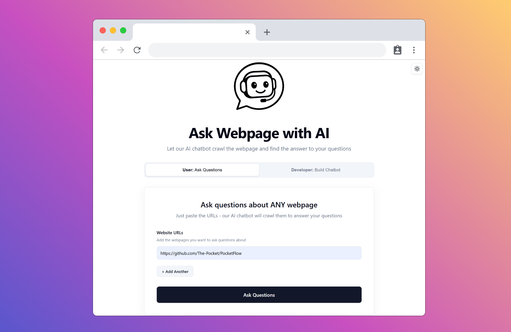
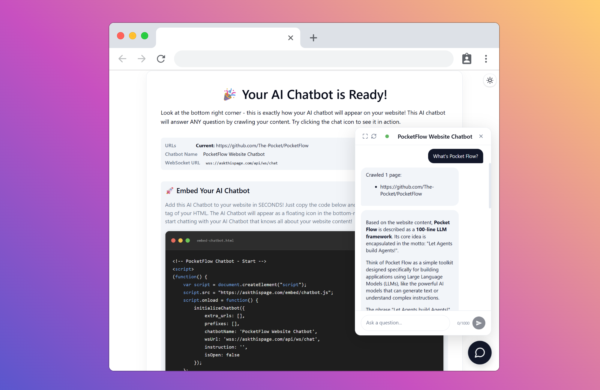
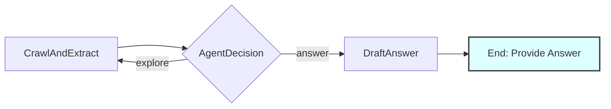

<h1 align="center">"Set & Forget" AI Chatbot for Your Website</h1>


[](https://github.com/The-Pocket/PocketFlow)
 <a href="https://discord.gg/hUHHE9Sa6T">
    
</a>
> *Want an AI chatbot for your website? The chatbot itself is easy—the real headache is keeping its knowledge up-to-date every time you change your content. This tutorial shows you how to build a truly "set and forget" AI chatbot that learns directly from your live website, so its knowledge stays current automatically. No manual updates. Ever.*

<p align="center">
  <a href="https://github.com/The-Pocket/PocketFlow" target="_blank">
    
  </a>
</p>

<p align="center">
  <strong>💬 Use Our Free Service at <a href="https://askthispage.com/" target="_blank">https://askthispage.com/</a> to try out the Chatbot💬</strong>


</p>

This is a tutorial project for [Pocket Flow](https://github.com/The-Pocket/PocketFlow), a 100-line LLM framework. The chatbot intelligently explores multiple web pages, makes decisions about which content is relevant, and provides comprehensive answers based on the discovered information.

- Check out the [Substack Post Tutorial](https://pocketflow.substack.com/p/the-easiest-way-to-build-an-ai-chatbot) for more


- **📺 Technical deep dive coming soon!** Subscribe to [My Channel](https://www.youtube.com/@ZacharyLLM?sub_confirmation=1)!


## 🚀 Getting Started

1. **Install Packages:**
   ```bash
   pip install -r requirements.txt
   ```

2. **Install Browser for Crawler:**
   The `utils` directory contains a web crawler that depends on Playwright. To ensure all utilities can run, install its browser dependencies:
   ```bash
   python -m playwright install --with-deps chromium
   ```

3. **Set API Key:**
   Set the environment variable for your Google Gemini API key.
   ```bash
   export GEMINI_API_KEY="your-api-key-here"
   ```
   *(Replace `"your-api-key-here"` with your actual key)*

4. **Verify API Key (Optional):**
   Run a quick check using the utility script. If successful, it will print a short joke.
   ```bash
   python utils/call_llm.py
   ```
   *(Note: This requires a valid API key to be set.)*

5. **Run the Support Bot (Command Line):**
   ```bash
   python main.py <start_url1> [start_url2] ... "<question>" [instruction]
   ```

   **Examples:**
   ```bash
   # Basic usage with single URL
   python main.py https://cloud.google.com/vertex-ai/generative-ai/docs/models/gemini/2-5-pro "What is the pricing for Gemini 2.5 pro?"
   
   # Multiple URLs with custom instruction
   python main.py https://github.com/scikit-learn/scikit-learn https://scikit-learn.org/stable/ "How do I install this?" "Focus on technical documentation and setup guides"
   
   # Specific instructions for different use cases
   python main.py https://azure.microsoft.com/en-us/ "What are your pricing plans?" "Look for pricing information and compare different tiers"
   
   python main.py https://github.com/the-pocket/PocketFlow "How does PocketFlow work?" "Prioritize README and documentation files"
   ```

   Our AI chatbot relies on web crawling (see [`web_crawler.py`](utils/web_crawler.py)) to understand your content. Please note these limitations:
      - Pages with complex JavaScript rendering may not be fully accessible
      - Pages requiring human verification (like CAPTCHAs) cannot be processed
      - For authenticated pages, you'll need to implement custom authentication logic in [`chatbot.js`](static/chatbot.js) and [`server.py`](server.py)

6. **Host the Web Server:**
   Start the web server to host the interactive chatbot interface.
   
   **Option 1: Direct Python hosting**
   ```bash
   python server.py
   ```
   
   **Option 2: Docker hosting**
   You can also host it using our Docker file:
   ```bash
   docker build -t website-chatbot .
   docker run -p 8000:8000 -e GEMINI_API_KEY="your-api-key-here" website-chatbot
   ```
   
   Once the server is running, open your web browser and navigate to `http://localhost:8000`. You can enter URLs and your question in the form to see the bot work in real-time.

   1. **Enter Your Website URL**: Input the URL of your website to preview how the chatbot will look and behave with your content

      <p align="center">
      
      </p>

   2. **Try the Chatbot**: Test the AI chatbot's responses. We also provide JavaScript code to easily embed the chatbot into your website

      <p align="center">
      
      </p>


      
## Architecture

The AI chatbot uses an intelligent agent-based architecture with three main components:

- **CrawlAndExtract**: Batch processes multiple URLs to extract content and discover links
- **AgentDecision**: Makes intelligent decisions about whether to answer or explore more pages
- **DraftAnswer**: Generates comprehensive answers based on collected knowledge



For detailed architecture information, see the [design documentation](docs/design.md) and [implementation](nodes.py).
