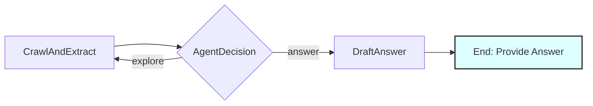

# Design Doc: Web Support Bot

> Please DON'T remove notes for AI

## Requirements

> Notes for AI: Keep it simple and clear.
> If the requirements are abstract, write concrete user stories

The AI Support Bot should:

1. Take multiple starting webpage URLs and an initial user question as input
2. For follow-up questions, reuse previously crawled data and conversation history
3. Extract content from multiple webpages simultaneously and identify all available links
4. Act as an intelligent agent that can:
   - Draft responses to questions based on currently available content and conversation history
   - Decide whether to explore additional links to gather more information
   - Refuse to answer questions that are irrelevant to the website's content
   - Process multiple URLs in batches for efficient exploration

**User Stories:**
- As a user, I want to provide multiple starting URLs (e.g., main site + documentation site) and ask "What are your return policies?" to get comprehensive answers
- As a user, I want the bot to refuse irrelevant questions like "What's the weather?" on an e-commerce site
- As a user, I want the bot to explore multiple pages (FAQ, product pages, support docs) simultaneously to give comprehensive answers
- As a user, after asking an initial question, I want to ask a follow-up question like "What about for international orders?" and have the bot use the previous context to answer, potentially crawling more pages if needed

## Flow Design

> Notes for AI:
> 1. Consider the design patterns of agent, map-reduce, rag, and workflow. Apply them if they fit.
> 2. Present a concise, high-level description of the workflow.

### Applicable Design Pattern:

1. **Agent Pattern**: The core decision-making logic that determines whether to answer, explore more links, or refuse the question
2. **RAG Pattern**: Retrieval of webpage content to augment the generation of responses
3. **Map-Reduce Pattern**: Process multiple URLs simultaneously in batches
4. **Workflow Pattern**: Sequential processing of webpage batches followed by agent decision-making and answer generation

### Flow high-level Design:

1. **CrawlAndExtract**: Batch processes multiple URLs simultaneously to extract clean text content AND discover all links from those pages
2. **AgentDecision**: The core agent that analyzes the user question against available content and decides next action:
   - `answer`: Move to answer generation (includes both regular answers and refusals)
   - `explore`: Visit additional links (and selects which URLs to explore next)
3. **DraftAnswer**: Generates the final answer based on collected knowledge when decision is "answer" (handles both answers and refusals)



## Utility Functions

> Notes for AI:
> 1. Understand the utility function definition thoroughly by reviewing the doc.
> 2. Include only the necessary utility functions, based on nodes in the flow.

1. **Call LLM** (`utils/call_llm.py`)
   - *Input*: prompt (str)
   - *Output*: response (str)
   - *Necessity*: Used by AgentDecision node for decision-making and DraftAnswer node for answer generation

2. **Web Crawler** (`utils/web_crawler.py`)
   - *Input*: url (str), allowed_domains (list[str])
   - *Output*: tuple of (clean_text_content (str), list_of_links (list[str]))
   - *Necessity*: Used by CrawlAndExtract node to fetch webpage content and extract all links in a single operation

3. **URL Validator** (`utils/url_validator.py`)
   - *Input*: url (str), allowed_domains (list[str])
   - *Output*: is_valid (bool)
   - *Necessity*: Used by CrawlAndExtract node to filter links within allowed domains. If allowed_domains is empty, all valid URLs are allowed (no domain filtering)

## Node Design

### Shared Store

> Notes for AI: Try to minimize data redundancy

The shared store structure is organized as follows:

```python
shared = {
    "user_question": "What is your return policy?", # Input: User's current question
    "conversation_history": [],                   # Input: List of {"user": "question", "bot": "answer"}
    "instruction": "Focus on finding official policies and procedures. Prioritize FAQ and help pages.", # Input: Instructions for how to answer and crawl
    "allowed_domains": ["example.com"],           # Input: List of domains allowed for exploration (e.g., ["example.com", "support.example.com"])
    "max_iterations": 5,                          # Input: Maximum exploration iterations before forced answer
    "max_pages": 100,                             # Input: Maximum pages to visit (default: 100)
    "content_max_chars": 10000,                   # Input: Maximum characters per page content (default: 10000)
    "links_max_chars": 500,                       # Input: Maximum characters per individual URL (default: 500)
    "url_truncation_buffer": 10,                  # Input: Buffer space for "..." in URL truncation (default: 10)
    "max_links_per_page": 300,                    # Input: Maximum links to store per page (default: 300)
    "max_urls_per_iteration": 5,                  # Input: Maximum URLs to explore per iteration (default: 5)
    
    "urls_to_process": [],                        # Queue of URL indices to process in next batch (references all_discovered_urls)
    "visited_urls": set(),                        # Set of URL indices that have been visited
    "all_discovered_urls": [],                    # List of all URLs discovered (indexed by position)
    
    "url_content": {},                            # Dict mapping URL index to extracted content
    "url_graph": {},                              # Dict mapping URL index to list of linked URL indices
    
    "current_iteration": 0,                       # Current exploration iteration (reset for each new question)
    
    "final_answer": None,                         # Final response to user (includes refusal reasons if applicable)
    "useful_visited_indices": [],                 # List of URL indices that were most useful for answering (set by AgentDecision)
    "decision_reasoning": ""                      # Reasoning from AgentDecision passed to DraftAnswer
}
```

### Node Steps

> Notes for AI: Carefully decide whether to use Batch/Async Node/Flow.

1. **CrawlAndExtract**
   - *Purpose*: Process all queued URLs simultaneously to extract clean text content AND discover all links from those pages
   - *Type*: BatchNode
   - *Steps*:
     - *prep*: Read `urls_to_process` indices from the shared store and convert them to actual URLs using `all_discovered_urls`. The calling application is responsible for initially populating `all_discovered_urls` and `urls_to_process` with the starting URLs.
     - *exec*: For each URL, use web_crawler utility to fetch webpage content and extract links simultaneously, then return raw content and links
     - *post*: Filter links with url_validator using allowed_domains, store content in url_content using URL index as key, add URL indices to visited_urls, add new URLs to all_discovered_urls list, update url_graph structure mapping URL indices to lists of linked URL indices

2. **AgentDecision**
   - *Purpose*: Intelligent agent that decides whether to answer or explore more. If exploring, also selects the next URLs to process. Focus purely on decision-making without answer generation
   - *Type*: Regular
   - *Steps*:
     - *prep*: Read `user_question`, `conversation_history`, `instruction`, `url_content`, `url_graph`, `all_discovered_urls`, `visited_urls`, `current_iteration`, and `max_iterations`. Construct knowledge base on-the-fly from `url_content` of visited pages
     - *exec*: Use `call_llm` utility with structured prompt (including `instruction` and `conversation_history`) showing URL graph to make decision (answer/explore). If `current_iteration >= max_iterations`, force decision to "answer". If decision is "explore", also select the most relevant unvisited URL indices based on instruction guidance. Do NOT generate answers here
     - *post*: Set urls_to_process with selected URL indices and increment current_iteration if exploring. Return corresponding action

3. **DraftAnswer**
   - *Purpose*: Generate the final answer based on all collected knowledge when AgentDecision determines it's time to answer. Handles both regular answers and refusals for irrelevant questions
   - *Type*: Regular
   - *Steps*:
     - *prep*: Read `user_question`, `conversation_history`, `instruction`, `decision_reasoning`, and construct knowledge base from all visited pages in `url_content`
     - *exec*: Use `call_llm` utility to generate comprehensive answer based on `user_question`, `conversation_history`, `instruction`, and knowledge base. Includes logic to refuse irrelevant questions
     - *post*: Store final_answer in shared store

